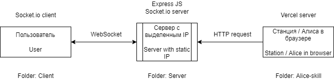

## Навык для [алисы](https://yandex.ru/alice) - "Управление компьютером"
> Вы можете управлять вашим компьютером, используя [яндекс станцию](https://yandex.ru/alice/station)  
> Проект легко расширяется. На данный момент предусмотрено множество команд  
> Возможности такого навыка безграничны, поскольку алиса лишь отправляет тексовые команды на ваш ПК, а NodeJS сервер выполняет необходимые действия. Вы можете выполнять команды из коносли Windows, управлять мышью, клавиатурой, буфером обмена и тд.

### Сейчас реализованы такие команды как:
 - Нажатие и зажатие кнопок клавиатуры
 - Открытие ссылок в браузере
 - Нажатие сочетаний клавиш
 - Открытие диалогов ВК
 - Быстрые команды (выделить все, отправить, выделить слово и тд.)
 - Голосовой ввод

Это лишь малое, что можно придумать под ваши задачи.

### Как работает?

При запуске навыка "Управление компьютером" [Алиса](https://yandex.ru/alice) отправляет HTTP запрос на сервер с выделенным IP-адресом сервер проверяет команду и отправляет через WebSocket([socket.io](https://socket.io/)) строку с командой на клиент (компьютер с запущенной программой)

#### Схема системы

